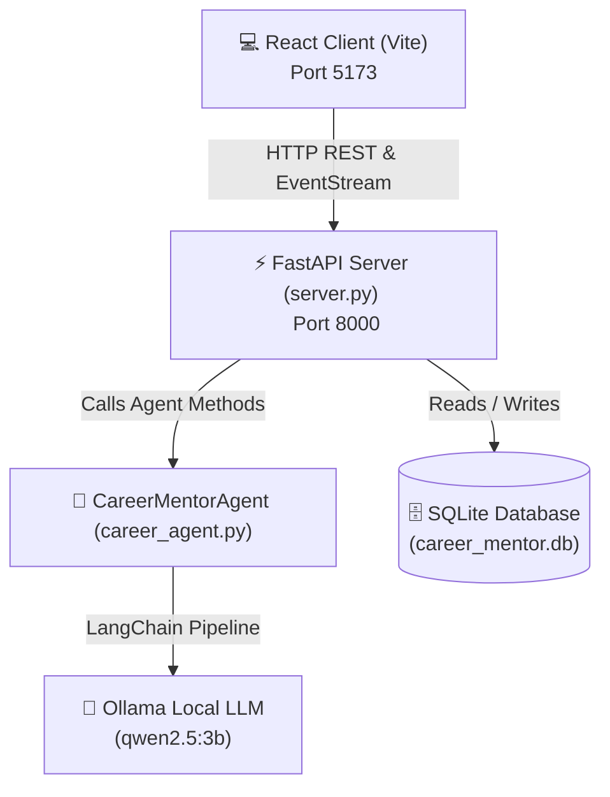

# 🎓 AI Career Mentor — GenAI Career Guidance & Planning Platform

<p align="center">
  <strong>Your personal AI-powered career advisor for skill gap analysis, personalized roadmaps, interview prep, and learning tracking.</strong>
</p>

<p align="center">
  <a href="https://codespaces.new/korevinay39-hash/AI-Career-Mentor">
    
  </a>
  <a href="https://gitpod.io/#https://github.com/korevinay39-hash/AI-Career-Mentor">
    
  </a>
</p>

<p align="center">
  
  
  
  
  
  
</p>

---

## ⚡ 1-Click Cloud Execution

Run this entire application instantly in your browser without installing anything locally:

[](https://codespaces.new/korevinay39-hash/AI-Career-Mentor)

> **How it works**: Clicking the button opens a dedicated cloud container with Python and Node.js pre-configured. Both the backend and frontend launch automatically.

---

## 📖 Table of Contents

- [Overview](#-overview)
- [Key Features](#-key-features)
- [System Architecture](#-system-architecture)
- [Project Structure](#-project-structure)
- [Quick Start (Local)](#-quick-start-local)
  - [Prerequisites](#prerequisites)
  - [One-Click Windows Launch](#option-a-one-click-windows-launcher)
  - [Manual Setup](#option-b-manual-setup)
- [Alternative Run Modes](#-alternative-run-modes)
- [API Endpoints](#-api-endpoints)
- [Tech Stack](#-tech-stack)

---

## 🌟 Overview

**AI Career Mentor** bridges the gap between where a student is today and where they want to be professionally. By leveraging locally hosted LLMs through **Ollama** and **LangChain**, the mentor analyzes your current skillset, benchmarks it against industry expectations for your target role, designs step-by-step learning roadmaps, conducts mock interviews, suggests portfolio-grade projects, and tracks your progress in real-time.

---

## ✨ Key Features

| Feature | Description |
| :--- | :--- |
| 💬 **AI Career Chat** | Interactive conversation with prompt shortcuts and streaming token-by-token responses. |
| 📊 **Skill Gap Analysis** | Compares your existing skills with target job requirements to identify missing competencies. |
| 🗺️ **Personalized Roadmap** | Custom milestone-based transition plan tailored to your timeline and goals. |
| 📈 **Curriculum Progress** | Interactive checklist of 12 core competencies with live % progress bar stored in SQLite. |
| 🎯 **AI Next Task Suggestion** | Suggests the exact next topic or project step based on what you have already finished. |
| 🎤 **Interview Prep** | Role-tailored behavioral and technical interview questions with recommended talking points. |
| 💡 **Project Recommendations** | Real-world project concepts tailored to strengthen weak areas on your resume. |
| ⏹️ **ChatGPT-Style Stop** | Cancel generation mid-stream with a single click, saving all tokens streamed so far. |
| 💾 **Profile Persistence** | Saves student education, skills, and goals directly into SQLite. |

---

## 🏛️ System Architecture



---

## 📂 Project Structure

```text
ai-career-mentor/
├── .devcontainer/             # 1-Click GitHub Codespaces configuration
│   └── devcontainer.json
├── frontend/                  # Modern React Frontend (Vite)
│   ├── src/
│   │   ├── App.jsx            # Main app with all 7 feature tabs & streaming
│   │   ├── App.css            # Component styles & layout
│   │   ├── index.css          # Design system & dark theme variables
│   │   └── main.jsx
│   ├── package.json
│   └── vite.config.js         # API proxy configuration
├── data/
│   └── resources.json         # Curated learning resources across categories
├── career_agent.py            # LangChain CareerMentorAgent core logic
├── database.py                # SQLite database management functions
├── prompts.py                 # Structured system & user prompts
├── llm.py                     # Ollama LangChain initialization
├── server.py                  # FastAPI REST & streaming server
├── main.py                    # Terminal CLI entry point
├── app.py                     # Legacy Streamlit UI interface
├── start_app.bat              # One-click Windows launcher
├── requirements.txt           # Python dependencies
└── README.md                  # Project documentation
```

---

## 🚀 Quick Start (Local)

### Prerequisites

1. **Python 3.10+** (Tested on Python 3.12)
2. **Node.js 18+** & npm
3. **Ollama** installed locally ([ollama.com](https://ollama.com))
   ```bash
   # Pull the default model
   ollama pull qwen2.5:3b
   ollama run qwen2.5:3b
   ```

---

### Option A: One-Click Windows Launcher

Simply double-click or run from your command prompt:
```cmd
start_app.bat
```
This automatically launches both the **FastAPI server** on `http://localhost:8000` and the **React frontend** on `http://localhost:5173`.

---

### Option B: Manual Setup

#### 1. Setup Backend:
```bash
# Create and activate virtual environment
python -m venv venv
.\venv\Scripts\activate       # Windows
# source venv/bin/activate    # Mac/Linux

# Install dependencies
pip install -r requirements.txt

# Run FastAPI server
uvicorn server:app --reload --port 8000
```

#### 2. Setup Frontend:
```bash
cd frontend
npm install
npm run dev
```

#### 3. Open in Browser:
Visit **`http://localhost:5173`** to access the application.

---

## 🔄 Alternative Run Modes

### 1. Terminal CLI Mode
To interact with your career mentor directly from the command line:
```bash
python main.py
```

### 2. Streamlit Mode (Legacy)
If you prefer running the original Streamlit interface:
```bash
streamlit run app.py
```

---

## 📡 API Endpoints

The FastAPI backend exposes interactive Swagger documentation at **`http://127.0.0.1:8000/docs`**.

| Method | Endpoint | Description |
| :--- | :--- | :--- |
| `GET` | `/api/health` | Check API server status |
| `GET` | `/api/profile` | Retrieve saved student profile |
| `POST` | `/api/profile` | Save or update student profile |
| `GET` | `/api/progress` | Fetch list of completed topics |
| `POST` | `/api/progress` | Mark a topic as completed |
| `GET` | `/api/resources` | Fetch category resources from JSON |
| `POST` | `/api/ai/chat` | Stream AI chat response |
| `POST` | `/api/ai/skill-analysis` | Stream AI skill gap evaluation |
| `POST` | `/api/ai/roadmap` | Stream personalized learning milestones |
| `POST` | `/api/ai/next-task` | Stream next recommended action |
| `POST` | `/api/ai/interview` | Stream mock interview questions |
| `POST` | `/api/ai/projects` | Stream customized portfolio project ideas |

---

## 🛠️ Tech Stack

* **Frontend**: [React 18](https://react.dev/), [Vite](https://vitejs.dev/), [Lucide React](https://lucide.dev/), [React Markdown](https://github.com/remarkjs/react-markdown)
* **Backend API**: [FastAPI](https://fastapi.tiangolo.com/), [Uvicorn](https://www.uvicorn.org/)
* **AI Orchestration**: [LangChain](https://www.langchain.com/), [LangChain-Ollama](https://github.com/langchain-ai/langchain)
* **LLM Engine**: [Ollama](https://ollama.com/) running `qwen2.5:3b`
* **Database**: [SQLite](https://www.sqlite.org/)
